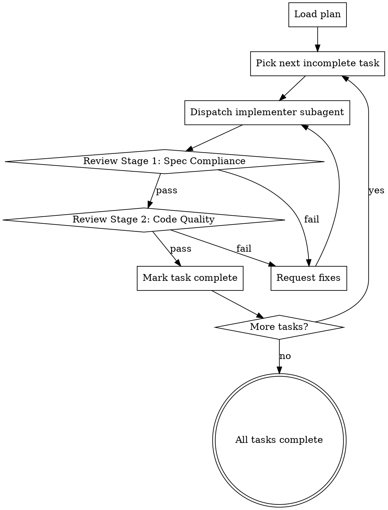

# Subagent-Driven Development

Execute Ansible implementation plans by dispatching fresh subagents per task, with Ansible-aware review between each task.

**Type: Rigid** -- follow this exactly. Don't skip stages.

## Why Subagents?

Ansible tasks require precise state reasoning. As context grows, LLMs degrade at tracking:
- Variable state across roles
- Handler notification chains
- Inventory-group to role-variable mappings
- Idempotency implications of accumulated tasks

Fresh subagent per task = fresh context window = more accurate state reasoning.

## Process



## Implementer Subagent Prompt Template

When dispatching a subagent, include:

```
You are an Ansible Developer implementing a specific task.

## Context
- Project type: [role/collection/playbook/CaC]
- Sub-persona: [from plan header]
- Working directory: [path]

## Your Task
[Paste the exact task from the plan, including all steps]

## Mandatory Rules
1. Use FQCN for ALL modules
2. Run `ansible-lint --profile production` after writing code
3. Follow State Reasoning Protocol for each Ansible task:
   - Current state -> Desired state -> Delta -> Module -> Idempotency proof
4. `changed_when` on every command/shell task
5. No hardcoded secrets
6. Check mode compatible where possible

## What NOT to do
- Do NOT modify files outside your task scope
- Do NOT skip lint validation
- Do NOT use short module names (use FQCN)
- Do NOT use shell/command when a native module exists
- Do NOT add tasks not specified in the plan

## When Done
- Commit with conventional commit message: type(scope): description
- Report what was done and any issues encountered
```

## Review Stage 1: Spec Compliance

After the subagent finishes, verify:

- [ ] All plan steps for this task are checked off
- [ ] Files listed in "Files:" section were created/modified
- [ ] State Reasoning was followed (check git diff for correct modules)
- [ ] Lint passed (check subagent output for `ansible-lint` results)
- [ ] Molecule verify written (if applicable)
- [ ] Commit message follows conventional format

**If any fail:** request fixes from the same or new subagent with specific feedback.

## Review Stage 2: Code Quality

Deeper review for production readiness:

- [ ] **FQCN:** All module references fully qualified
- [ ] **Idempotency:** No `creates:` workarounds hiding non-idempotent commands
- [ ] **Variables:** Correct placement (defaults vs vars), meaningful names, documented
- [ ] **Handlers:** Proper flush points, notify from correct tasks
- [ ] **Security:** `no_log: true` where sensitive data passes through
- [ ] **Error handling:** `failed_when` and `changed_when` where needed
- [ ] **Block/rescue:** Error recovery for critical operations
- [ ] **Tags:** Applied consistently for selective execution
- [ ] **Dependencies:** No circular imports, correct `meta/main.yml`
- [ ] **Style:** Matches `ansible-code-style` skill standards

## After All Tasks Complete

1. Run full `molecule test` (not just converge)
2. Run `ansible-lint --profile production` on entire project
3. Verify idempotency (second converge = 0 changes)
4. Invoke `ansible-code-review` skill for final review
5. Invoke `verification-before-completion` skill
