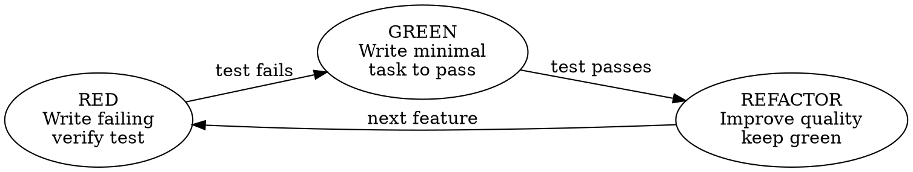

# Test-Driven Development for Ansible

Adapt the classic RED-GREEN-REFACTOR cycle to Ansible with Molecule as the test harness.

**Type: Rigid** -- follow the cycle exactly. Do not skip RED.

## The Cycle



### RED: Write a Failing Test

Write a Molecule `verify.yml` test that checks for the desired state:

```yaml
- name: Verify nginx is installed and running
  hosts: all
  gather_facts: false
  tasks:
    - name: Check nginx package is installed
      ansible.builtin.command:
        cmd: nginx -v
      changed_when: false
      register: nginx_check
      failed_when: nginx_check.rc != 0

    - name: Check nginx service is running
      ansible.builtin.systemd:
        name: nginx
      register: nginx_service
      failed_when: nginx_service.status.ActiveState != "active"
```

Run `molecule verify` -- it MUST fail. If it passes, your test isn't testing anything new.

### GREEN: Write Minimal Code

Write the minimum Ansible task(s) to make the test pass:

```yaml
- name: Install nginx
  ansible.builtin.dnf:
    name: nginx
    state: present

- name: Start and enable nginx
  ansible.builtin.systemd:
    name: nginx
    state: started
    enabled: true
```

Run `molecule converge && molecule verify` -- it MUST pass.

### REFACTOR: Improve Quality

With green tests, improve the code:
- Add variables to `defaults/main.yml` (parameterize hardcoded values)
- Add `tags:` for selective execution
- Add `handlers:` to restart on config changes
- Add `block/rescue:` for error recovery
- Run `ansible-lint --profile production` and fix violations

Run `molecule verify` again -- it MUST still pass.

## Anti-Rationalization Table

| Thought | Reality |
|---------|---------|
| "I'll write the role first, then add tests" | That's waterfall, not TDD. Write the test first. |
| "This task is too simple to test" | `service: started` is simple. `service: started + enabled + handler` isn't. Test it. |
| "Molecule is slow, I'll test later" | Slow tests > no tests > production failures. |
| "I know this module works" | You know the module works. You don't know YOUR usage works. |
| "The lint check is enough" | Lint checks syntax, not behavior. Test behavior. |
| "I'll test the whole role at the end" | One failing test in 20 tasks = hunting for the bug. Test incrementally. |

## Molecule Test Types

| Test Type | When | How |
|-----------|------|-----|
| **Functional** | Always | Verify desired state exists (package installed, service running, file contains X) |
| **Idempotency** | Always | Second converge = 0 changes (built into `molecule test`) |
| **Negative** | When handling edge cases | Verify bad input fails gracefully, not silently |
| **Destructive** | When testing `state: absent` | Verify removal works and doesn't break dependents |

## Verify Test Patterns

### Check a package is installed
```yaml
- name: Verify package
  ansible.builtin.package_facts:
    manager: auto
- name: Assert package present
  ansible.builtin.assert:
    that: "'nginx' in ansible_facts.packages"
```

### Check a service is running
```yaml
- name: Get service facts
  ansible.builtin.service_facts:
- name: Assert service active
  ansible.builtin.assert:
    that: "ansible_facts.services['nginx.service'].state == 'running'"
```

### Check a file contains expected content
```yaml
- name: Read config file
  ansible.builtin.slurp:
    src: /etc/nginx/nginx.conf
  register: config_content
- name: Assert config contains expected setting
  ansible.builtin.assert:
    that: "'worker_processes auto;' in config_content.content | b64decode"
```

### Check a port is listening
```yaml
- name: Check port is listening
  ansible.builtin.wait_for:
    port: 80
    timeout: 5
```

## Incremental Development

For a role with 5 tasks, the TDD cycle produces 5 iterations:

1. RED: test for package -> GREEN: install task -> REFACTOR: variables
2. RED: test for config -> GREEN: template task -> REFACTOR: handler
3. RED: test for service -> GREEN: systemd task -> REFACTOR: enable
4. RED: test for firewall -> GREEN: firewalld task -> REFACTOR: variable
5. RED: test for integration -> GREEN: verify connectivity -> REFACTOR: final lint

Each iteration adds one concern. Each iteration has green tests.
