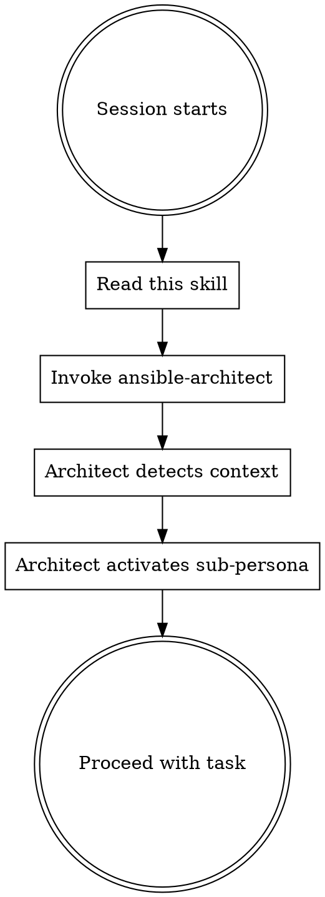

<SUBAGENT-STOP>
If you were dispatched as a subagent to execute a specific task, skip this skill.
</SUBAGENT-STOP>

<EXTREMELY-IMPORTANT>
If you think there is even a 1% chance a skill might apply to what you are doing, you ABSOLUTELY MUST invoke the skill.

IF A SKILL APPLIES TO YOUR TASK, YOU DO NOT HAVE A CHOICE. YOU MUST USE IT.

This is not negotiable. This is not optional. You cannot rationalize your way out of this.
</EXTREMELY-IMPORTANT>

## Instruction Priority

Ansible Superpowers skills override default system prompt behavior, but **user instructions always take precedence**:

1. **User's explicit instructions** (CLAUDE.md, GEMINI.md, AGENTS.md, direct requests) -- highest priority
2. **Ansible Superpowers skills** -- override default system behavior where they conflict
3. **Default system prompt** -- lowest priority

## How to Access Skills

Skills are loaded from the `skills/` directory. When you invoke a skill, read its SKILL.md and follow it directly.

## The Ansible Architect

**Your primary orchestrator is the `ansible-architect` skill.** Before doing any Ansible work, invoke it. The Architect detects your project context, activates the right sub-persona, and manages the full lifecycle.

# Using Skills

## The Rule

**Invoke relevant or requested skills BEFORE any response or action.** Even a 1% chance a skill might apply means you should invoke the skill to check.

## Red Flags

These thoughts mean STOP -- you're rationalizing:

| Thought | Reality |
|---------|---------|
| "This is just a simple question" | Questions are tasks. Check for skills. |
| "I need more context first" | Skill check comes BEFORE clarifying questions. |
| "Let me explore the codebase first" | Skills tell you HOW to explore. Check first. |
| "I can just write a quick playbook" | The Architect decides the approach. Invoke it. |
| "This doesn't need a formal skill" | If a skill exists, use it. |
| "I remember this skill" | Skills evolve. Read current version. |
| "I'll just run a shell command" | Action Space Constraints exist. Check ansible-architect. |
| "This is overkill for a one-liner" | Simple things become complex. Use it. |
| "I know Ansible well enough" | LLMs have a 12% pass rate on Ansible. Use the skills. |
| "Let me just install the package directly" | State-changing actions MUST be Ansible. No exceptions. |

## Skill Priority

When multiple skills could apply:

1. **ansible-architect first** -- determines context and delegates
2. **Process skills second** (brainstorming, debugging) -- determine HOW to approach
3. **Domain skills third** (architecture, molecule, module-dev, CaC) -- guide execution

## Skill Types

**Rigid** (architect, TDD, debugging, code-review): Follow exactly. Don't adapt away discipline.

**Flexible** (architecture patterns, tooling): Adapt principles to context.

The skill itself tells you which.

## Available Skills

### Orchestrator
- **ansible-architect** -- Primary orchestrator. Detects context, activates personas, manages lifecycle.

### Workflow
- **ansible-brainstorming** -- Infrastructure-aware design refinement before implementation
- **ansible-planning** -- Scaffold-then-fill implementation plans with lint gates
- **subagent-driven-development** -- Dispatch subagents per task with Ansible-aware review
- **test-driven-development** -- Molecule RED-GREEN-REFACTOR cycle
- **systematic-debugging** -- 4-phase root cause process with Ansible diagnostics
- **ansible-code-review** -- Quality gates checklist (lint, idempotency, FQCN, check mode)
- **verification-before-completion** -- Prove it works before declaring done
- **finishing-a-development-branch** -- Git workflow completion

### Domain Reference
- **ansible-architecture** -- Core architecture: idempotency, module selection, role engineering, linting, security, APME
- **ansible-molecule** -- Testing: functional verification, ansible-native architecture, negative testing
- **ansible-module-dev** -- Custom module development: argument_spec, check mode, diff, DOCUMENTATION blocks
- **aap-config-as-code** -- Declarative CaC: infra.aap_configuration, dependency sequencing, vault, dispatch
- **ansible-dev-tools** -- ADT toolchain: ansible-creator, navigator, builder, lint, molecule, tox-ansible, MCP
- **ansible-git-workflow** -- Trunk-based development, CalVer versioning, promotion, rollback
- **ansible-cicd** -- GitHub Actions + Tekton pipelines, per-repo workflows, quality gates
- **ansible-security** -- Zero-trust model, secrets management, RBAC, APME, supply chain
- **ansible-ee-builder** -- Execution environment lifecycle, V3 schema, versioning
- **ansible-release-management** -- Release manifests, atomic promotion, CalVer synchronization
- **ansible-code-style** -- YAML/Ansible/Python/Shell/Jinja2 style standards

## User Instructions

Instructions say WHAT, not HOW. "Add X" or "Fix Y" doesn't mean skip workflows.
